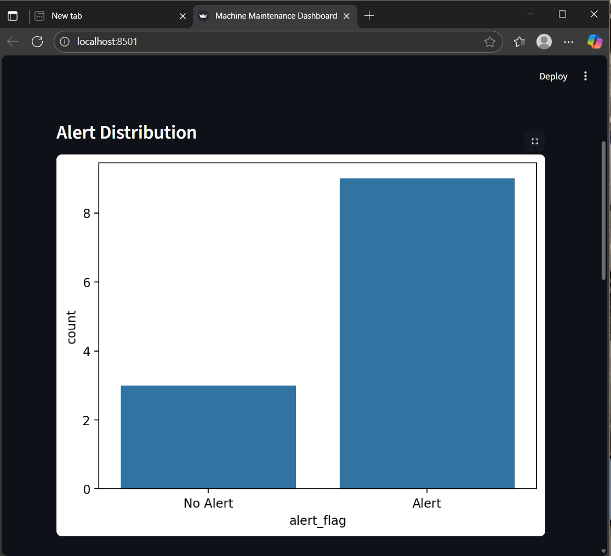
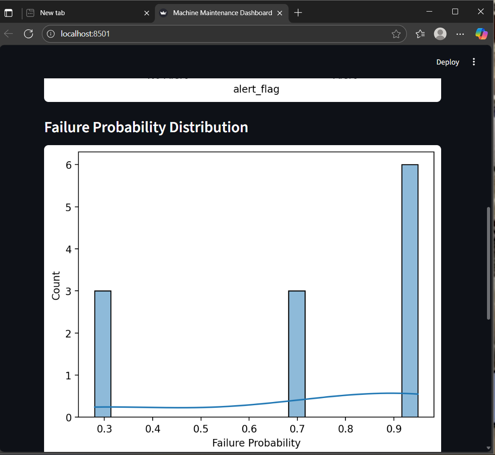

# SQL + Streamlit Manufacturing Dashboard

## 📌 Overview
This project stores manufacturing production data in MySQL and uses Python (pandas + Streamlit) to analyze and visualize it.

## ✨ Features
- Store machine production & defect data in MySQL
- Run prediction script to label alerts
- Interactive dashboard with graphs & tables

## ⚙️ How to Run
1. Import schema.sql and sample_data.sql in MySQL
2. Install Python libraries:
3. Run predictions:
4. Launch dashboard:

## 📊 Screenshots
## Screenshots  

  
  

## 👤 Author
Khushi, NIT Kurukshetra
